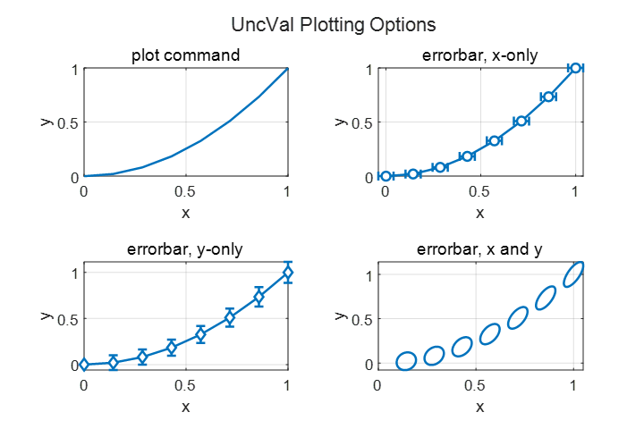

# UncValMatLab
MatLab class for handling uncertain values.

[](https://github.com/btmy87/UncValMatLab/actions/workflows/ci.yml)


Propagates uncertainty through basic matlab calculations, tracking sources
of uncertainty.  Most basic math operations are supported, along with some 
trigonometry and exponents.

```Matlab
x = UncVal(1.0, 0.1./2.0, "x"); % create values with standard uncertaities
y = UncVal(2.0, 0.2./2.0, "y"); % give values unique id's
z = sqrt(x.^2 + y.^2); % error is propagated through calculations

string(z) % convert scalars to strings
ans = 
    "UncVal (id=calc): 2.23607 ± 0.184391 (2-sigma)"

z.var_srcs % display sources of variance
ans = 
  3×5 table

     name       var      var_frac    src_var     sens  
    _______    ______    ________    _______    _______

    "y"         0.008     0.94118      0.01     0.89443
    "x"        0.0005    0.058824    0.0025     0.44721
    "const"         0           0         0      4.2188
```

Independent sources of error must be given unique id's by the user.
Dependencies between calculations are handled appropriately, but there is 
no mechanism for handling dependencies between user inputs.
```Matlab
x = UncVal(1.0, 0.1/2.0, "x");
y = UncVal(1.0, 0.1/2.0, "y");
z1 = sin(x).^2 + cos(y).^2; % has uncertainty with independent inputs
string(z1)
ans = 
    "UncVal (id=calc): 1 ± 0.128594 (2-sigma)"

z2 = sin(x).^2 + cos(x).^2; % identically equals 1 if inputs are correlated
string(z2)
ans = 
    "UncVal (id=calc): 1 ± 0 (2-sigma)"
```

Some array operations are supported, but be careful.  All array elements
with the same id are effectively dependent on one another.  This is not
expected to be true for a typical use pattern.

The plot and errorbar functions are overloaded so that objects can be 
passed directly to plot calls.  Errorbars are automatically configured.
Correlated errors are plotted as ellipses.

<picture>
  <source media="(prefers-color-scheme: dark)" srcset="dark.png">
  <source media="(prefers-color-scheme: light)" srcset="light.png">
  
</picture>
