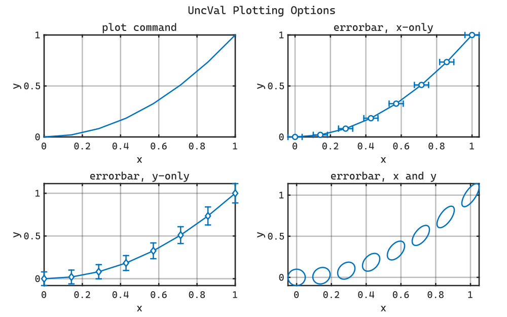

# UncVal

MatLab class for handling uncertain values.


<picture></picture><picture></picture>


Propagates uncertainty through basic matlab calculations, tracking sources of uncertainty. Most basic math operations are supported, along with some trigonometry and exponents.

```matlab
x = UncVal(1.0, 0.1./2.0, "x"); % create values with standard uncertaities
y = UncVal(2.0, 0.2./2.0, "y"); % give values unique id's
z = sqrt(x.^2 + y.^2); % error is propagated through calculations

disp(string(z)); % convert scalars to strings
```

```matlabTextOutput
UncVal (id=calc): 2.23607 ± 0.184391 (2-sigma)
```


Independent sources of error must be given unique id's by the user. Dependencies between calculations are handled appropriately, but there is no mechanism for handling dependencies between user inputs.

```matlab
x = UncVal(1.0, 0.1/2.0, "x");
y = UncVal(1.0, 0.1/2.0, "y");
z1 = sin(x).^2 + cos(y).^2; % has uncertainty with independent inputs
disp(string(z1));
```

```matlabTextOutput
UncVal (id=calc): 1 ± 0.128594 (2-sigma)
```

```matlab

z2 = sin(x).^2 + cos(x).^2; % identically equals 1 if inputs are correlated
disp(string(z2));
```

```matlabTextOutput
UncVal (id=calc): 1 ± 0 (2-sigma)
```


Some array operations are supported, but be careful.  All array elements with the same id are effectively  ependent on one another.  This is not expected to be true for a typical use pattern.


The plot and errorbar functions are overloaded so that objects can be  passed directly to plot calls.  Errorbars  re automatically configured. Correlated errors are plotted as ellipses.

```matlab
x = UncVal(linspace(0, 1, 8), 0.02, "x");
y = x.^2 + UncVal(0, 0.04, "y");

figure;
t = tiledlayout("flow", padding="compact", TileSpacing="compact");
title(t, "UncVal Plotting Options");
nexttile;hold on;xlabel("x");ylabel("y");
title("plot command", FontWeight="normal");
plot(x, y);

t.Title.Color = get(gca, "XColor"); % I have some funny defaults
t.Title.FontName = get(gca, "FontName");

nexttile;hold on;xlabel("x");ylabel("y");
title("errorbar, x-only", FontWeight="normal")
errorbar(x, y.val, Marker="o");

nexttile;hold on;xlabel("x");ylabel("y");
title("errorbar, y-only", FontWeight="normal")
errorbar(x.val, y, Marker="d");

nexttile;hold on;xlabel("x");ylabel("y");
title("errorbar, x and y", FontWeight="normal")
errorbar(x, y);
```

<picture>
  <source media="(prefers-color-scheme: dark)" srcset="resources/README_0_dark.svg">
  <source media="(prefers-color-scheme: light)" srcset="resources/README_0_light.svg">
  
</picture>

