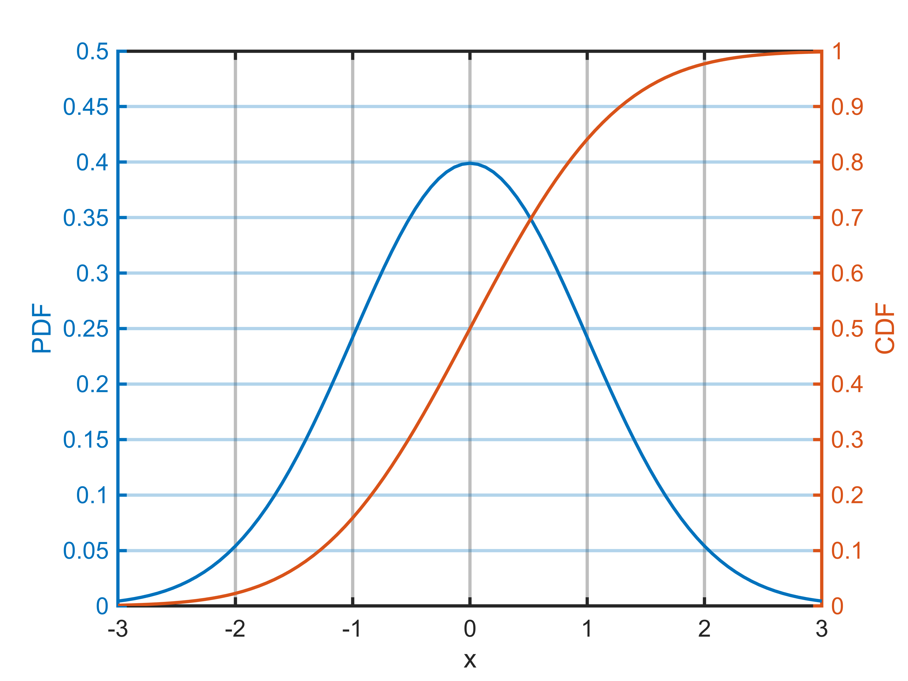
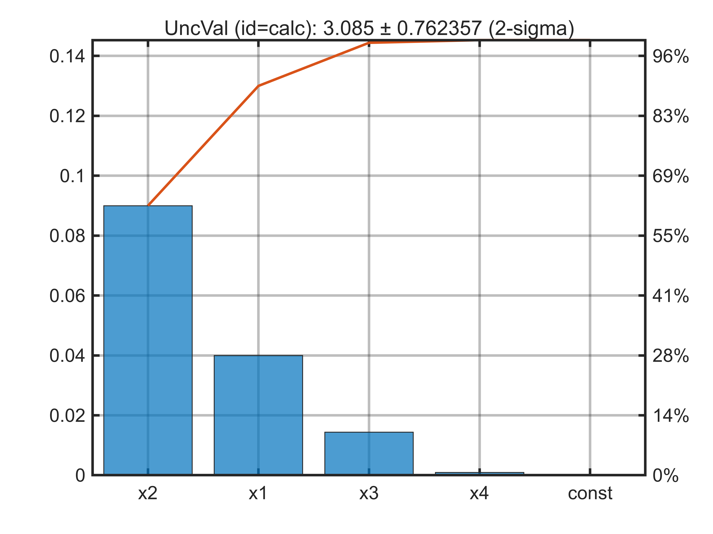

# UncVal Examples

`UncVal` is a MATLAB class for working with uncertain values, and propagating uncertainty through calculations.

# Basic Statistics

`UncVal` objects generally represent normal distributions.  Create the `UncVal` object by passing in the mean and standard deviation.  The object below will represent a standard normal distribution, $\mu =0$ , $\sigma =1$ .  A string identifier is also provided, which is important for propagating uncertainty later. 

```matlab
x = UncVal(0, 1, "x")
```

```matlabTextOutput
x = 
  UncVal with properties:

         val: 0
          id: "x"
     uncType: "1-sigma"
     std_unc: 1
    var_srcs: [1x6 table]

```

Many basic statistic functions are implemented, including mean, standard deviation, and interquartile range.

```matlab
fprintf("mean(x) = %g\n", mean(x));
```

```matlabTextOutput
mean(x) = 0
```

```matlab
fprintf("std(x) = %g\n", std(x));
```

```matlabTextOutput
std(x) = 1
```

```matlab
fprintf("iqr(x) = %g\n", iqr(x));
```

```matlabTextOutput
iqr(x) = 1.34898
```

Converting to string shows uncertainty at the 2\-sigma level.

```matlab
disp(string(x))
```

```matlabTextOutput
UncVal (id=x): 0 ± 2 (2-sigma)
```
# Distribution Plots

The probability density function and cummulative distribution function can be queried and plotted.

```matlab
[p, xp] = pdf(x);
[c, xc] = cdf(x);
figure(Name="example1_distribution");
ha = axes();hold on;
yyaxis left;
xlabel("x"); ylabel("PDF");
plot(xp, p);
yyaxis right;
ylabel("CDF");
plot(xc, c);
ha.YAxis(2).Color=ha.ColorOrder;
ha.YAxis(1).Limits = [0, 0.5]; % make tick marks align.
```

<picture>
  <source media="(prefers-color-scheme: dark)" srcset="example1_overview_media/dark/figure_0.png">
   <source media="(prefers-color-scheme: light)" srcset="example1_overview_media/light/figure_0.png">
   
</picture>

# Propagate Uncertainty

Uncertainty is propagated through calculations.  Sources of uncertainty are tracked individually.

```matlab
y = UncVal(3, 0.5, "y"); % another input value
z = x + y + 1;
string(z)
```

```matlabTextOutput
ans = "UncVal (id=calc): 4 ± 2.23607 (2-sigma)"
```

```matlab
z.var_srcs
```
| |name|var|var_frac|src_var|src_unc|sens|
|:--:|:--:|:--:|:--:|:--:|:--:|:--:|
|1|"x"|1|0.8000|1|1|1|
|2|"y"|0.2500|0.2000|0.2500|0.5000|1|
|3|"const"|0|0|0|0|1|


Pareto plots can be used to examine the sources of variance, $\sigma {\;}^{2\;}$ .

```matlab
z2 = UncVal(0, 0.2, "x1") + 2*UncVal(1, 0.15, "x2") + UncVal(0.3, 0.2, "x3").^2 + cos(UncVal(0.1, 0.3, "x4"));
figure();
ha = axes;hold on;
pareto(z2, 1);
title(string(z2), FontWeight="normal");
```

<picture>
  <source media="(prefers-color-scheme: dark)" srcset="example1_overview_media/dark/figure_1.png">
   <source media="(prefers-color-scheme: light)" srcset="example1_overview_media/light/figure_1.png">
   
</picture>

# Correlated Variables

Correlation between variables is handled appropriately.  The trigonometric identitiy below is always 1.0, even if the inputs are uncertain.

```matlab
theta = UncVal(pi/6, pi/60, "theta");
z3 = sin(theta).^2 + cos(theta).^2;
disp(string(z3));
```

```matlabTextOutput
UncVal (id=calc): 1 ± 0 (2-sigma)
```

If the inputs to the identify are uncorrelated, we see that the result is now uncertain.

```matlab
theta2 = UncVal(pi/6, pi/60, "theta2");
z4 = sin(theta).^2 + cos(theta2).^2;
disp(string(z4));
```

```matlabTextOutput
UncVal (id=calc): 1 ± 0.128255 (2-sigma)
```

 

