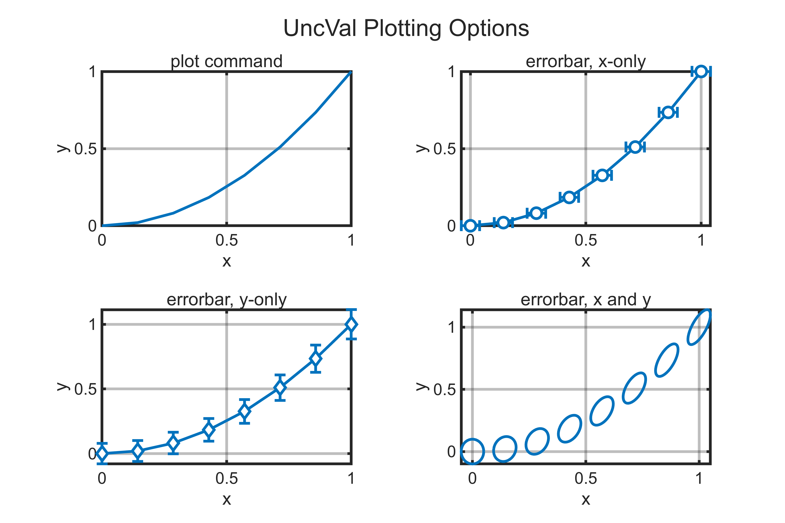

# Example 2: Arrays

Arrays of `UncVal` objects can be created and plotted.

# Creating Arrays

Arrays of `UncVal` objects can be created by passing an array input to the constructor

```matlab
x = UncVal(linspace(0, 1, 8), 0.02, "x");
a = UncVal(0, 0.04, "a");
y = x.^2 + a;
disp(y)
```

```matlabTextOutput
  1x8 UncVal array with properties:

        val: [0 0.0204 0.0816 0.1837 0.3265 0.5102 0.7347 1]
         id: "calc"
    uncType: "1-sigma"
    std_unc: [0.0400 0.0404 0.0416 0.0435 0.0461 0.0492 0.0527 0.0566]
```

Elements can be accessed like a normal array.

```matlab
disp(x(2))
```

```matlabTextOutput
  UncVal with properties:

         val: 0.1429
          id: "x"
     uncType: "1-sigma"
     std_unc: 0.0200
    var_srcs: [1x6 table]
```

Arrays can be concatenated, transposed, and reshaped as expected.

```matlab
xcat = [UncVal([0, 1], 0.1, "xc1"), UncVal([2, 3], 0.2, "xc2")]
```

```matlabTextOutput
xcat = 
        val: [0 1 2 3]
         id: "calc"
    uncType: "1-sigma"
    std_unc: [0.1000 0.1000 0.2000 0.2000]

```

```matlab
xtranspose = xcat'
```

```matlabTextOutput
xtranspose = 
         val: [4x1 double]
          id: "calc"
     uncType: "1-sigma"
     std_unc: [4x1 double]
    var_srcs: [2x6 table]

```

```matlab
xreshape = reshape(xcat, 2, [])
```

```matlabTextOutput
xreshape = 
        val: [2x2 double]
         id: "calc"
    uncType: "1-sigma"
    std_unc: [2x2 double]

```
# Plotting Arrays

Arrays can be sent directly to the `plot` and `errorbar` commands.  The `plot` command will only plot the nominal values.  The `errorbar` command will plot uncertainty in `x` or `y` if an `UncVal` object is passed.  If both `x` and `y` are `UncVal` objects, then the correlated uncertainty is plotted as the standard deviational ellipse.  Error bars are drawn at at 95.54% confidence ( $2\sigma \;$ in the 1D case).

```matlab
figure("defaultErrorBarLineWidth", 1.5, ...
    "Units", "in", "Position", [1,1,6,4]);
t = tiledlayout("flow");
title(t, "UncVal Plotting Options");
nexttile;hold on;xlabel("x");ylabel("y");
title("plot command", FontWeight="normal");
plot(x, y);

t.Title.Color = get(gca, "XColor"); % I have some funny defaults

ha = nexttile;hold on;xlabel("x");ylabel("y");
title("errorbar, x-only", FontWeight="normal")
errorbar(x, y.val, Marker="o", MarkerFaceColor=ha.Color);

nexttile;hold on;xlabel("x");ylabel("y");
title("errorbar, y-only", FontWeight="normal")
errorbar(x.val, y, Marker="d", MarkerFaceColor=ha.Color);

nexttile;hold on;xlabel("x");ylabel("y");
title("errorbar, x and y", FontWeight="normal")
errorbar(x, y);
```

<picture>
  <source media="(prefers-color-scheme: dark)" srcset="example2_arrays_media/dark/figure_0.png">
   <source media="(prefers-color-scheme: light)" srcset="example2_arrays_media/light/figure_0.png">
   
</picture>

# Functions that Reduce an Array

Many functions that normally reduce an array, do not reduce arrays of `UncVal` objects.  These functions can be thought of as acting on the distribution in the `UncVal` object, and not on the array.  For example, the `mean` and `std` functions, return the mean and standard deviation of the underlying distributions.  The array returned is the same size as the `UncVal` array.

```matlab
disp(x)
```

```matlabTextOutput
  1x8 UncVal array with properties:

        val: [0 0.1429 0.2857 0.4286 0.5714 0.7143 0.8571 1]
         id: "x"
    uncType: "1-sigma"
    std_unc: [0.0200 0.0200 0.0200 0.0200 0.0200 0.0200 0.0200 0.0200]
```

```matlab
disp(mean(x))
```

```matlabTextOutput
         0    0.1429    0.2857    0.4286    0.5714    0.7143    0.8571    1.0000
```

```matlab
disp(std(x))
```

```matlabTextOutput
    0.0200    0.0200    0.0200    0.0200    0.0200    0.0200    0.0200    0.0200
```

The `sum` function will reduce an array, but the statistical independence of the arguments must be considered.  The average of multiple values have less uncertainty if they are statistically independent, this is not true if they are statistically dependent.  Note that $1\sigma \;$ uncertainties are input to the constructors, but the $2\sigma \;$ value is displayed in the string.

```matlab
xind = [UncVal(1, 0.1, "x1"), UncVal(2, 0.1, "x2")];
disp("average of xind = " + string(sum(xind)/length(xind)));
```

```matlabTextOutput
average of xind = UncVal (id=calc): 1.5 ± 0.141421 (2-sigma)
```

```matlab
xdep = UncVal([1, 2], 0.1, "x");
disp("average of xdep = " + string(sum(xdep)/length(xdep)));
```

```matlabTextOutput
average of xdep = UncVal (id=calc): 1.5 ± 0.2 (2-sigma)
```
