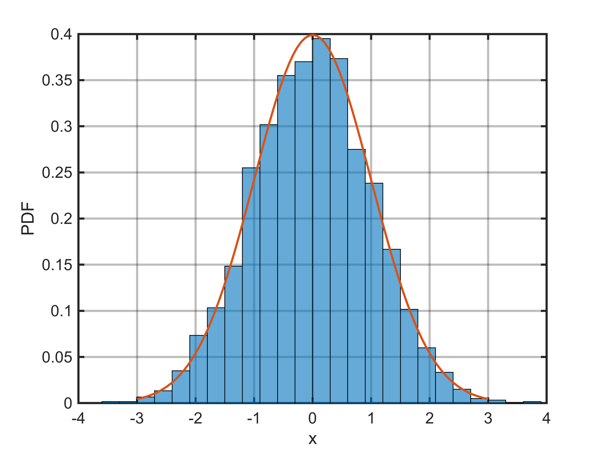
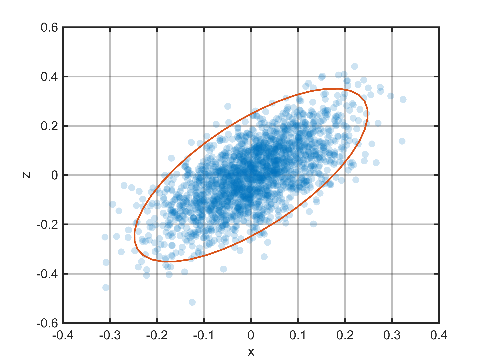
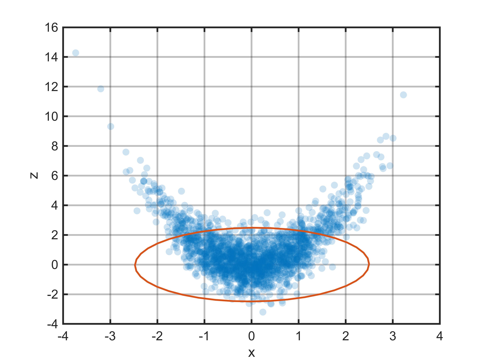

# Example 3: Monte Carlo
# `Generating Monte Carlo Draws`

`UncVal` objects can be used to generate Monte Carlo samples for examining the impact of nonlinearities on uncertainty propagation.

```matlab
x = UncVal(0, 1, "x");
numMC = 2000;
xmc = x.toMonteCarlo(numMC); % there is a default MC count, but it's a little high for the plots below

[p, xp] = pdf(x);

figure;
axes(XLim=[-4, 4]);hold on;
xlabel("x");
ylabel("PDF");
histogram(xmc, Normalization="pdf");
plot(xp, p);
```

<picture>
  <source media="(prefers-color-scheme: dark)" srcset="example3_montecarlo_media/dark/figure_0.png">
   <source media="(prefers-color-scheme: light)" srcset="example3_montecarlo_media/light/figure_0.png">
   
</picture>


```matlab
fprintf("mean(x  ) = %.4f, std(x  ) = %.4f\n" + ...
        "mean(xmc) = %.4f, std(xmc) = %.4f\n", ...
        mean(x), std(x), mean(xmc), std(xmc));
```

```matlabTextOutput
mean(x  ) = 0.0000, std(x  ) = 1.0000
mean(xmc) = 0.0213, std(xmc) = 1.0072
```
# Uncertainty Propagation

Uncertainty can be propagated using either the Monte Carlo draws or the `UncVal` object.  All uncertainty work should be done with one or the other, they cannot be mixed.  For example purposes, both are propagated side\-by\-side.  In normal usage, only one or the other would be used.

```matlab
x = UncVal(0, 0.1, "x");
y = UncVal(0, 0.1, "y");
xmc = x.toMonteCarlo(numMC);
ymc = y.toMonteCarlo(numMC);
z = sin(x) + y;
zmc = sin(xmc) + ymc;
```

In this example, and many practical cases, the linear methods do a good job capturing the uncertainty and correlation, while preserving information about the sources of uncertainty.

```matlab
corrLinear = corrcoef(x, z);
corrMC = corrcoef(xmc, zmc);
fprintf("z   = %7.4f ± %7.4f, corrcoeff = %7.4f\n" + ...    
    "zmc = %7.4f ± %7.4f, corrcoeff = %7.4f\n", ...
    mean(z  ), std(z  ).*2, corrLinear(1, 2), ...
    mean(zmc), std(zmc).*2, corrMC(1, 2));
```

```matlabTextOutput
z   =  0.0000 ±  0.2828, corrcoeff =  0.7071
zmc = -0.0020 ±  0.2839, corrcoeff =  0.7040
```

```matlab
figure;
axes;hold on;
xlabel("x");
ylabel("z");
scatter(xmc, zmc, "filled", ...
    MarkerFaceAlpha=50/255, ...
    MarkerEdgeColor="none");
errorbar(x, z);
```

<picture>
  <source media="(prefers-color-scheme: dark)" srcset="example3_montecarlo_media/dark/figure_1.png">
   <source media="(prefers-color-scheme: light)" srcset="example3_montecarlo_media/light/figure_1.png">
   
</picture>

# Limitations of Linear Propagation

There are times when linear propagation can breakdown; when the slope of the function is zero at the nominal value, or the uncertainty band is wide relative to the curvature.

```matlab
x = UncVal(0.01, 1, "x"); % plot won't work for x=0, but same problem slightly away from zero
y = UncVal(0, 1, "y");
xmc = x.toMonteCarlo(numMC);
ymc = y.toMonteCarlo(numMC);
z = x.^2 + y;
zmc = xmc.^2 + ymc;
corrLinear = corrcoef(x, z);
corrMC = corrcoef(xmc, zmc);

fprintf("z   = %7.4f ± %7.4f, corrcoeff = %7.4f\n" + ...    
    "zmc = %7.4f ± %7.4f, corrcoeff = %7.4f\n", ...
    mean(z  ), std(z  ).*2, corrLinear(1, 2), ...
    mean(zmc), std(zmc).*2, corrMC(1, 2));
```

```matlabTextOutput
z   =  0.0001 ±  2.0004, corrcoeff =  0.0200
zmc =  1.0265 ±  3.5608, corrcoeff =  0.0078
```

```matlab
figure;
ha = axes;hold on;
xlabel("x");
ylabel("z");
scatter(xmc, zmc, "filled", ...
    MarkerFaceAlpha=50/255, ...
    MarkerEdgeColor="none");
errorbar(x, z);
```

<picture>
  <source media="(prefers-color-scheme: dark)" srcset="example3_montecarlo_media/dark/figure_2.png">
   <source media="(prefers-color-scheme: light)" srcset="example3_montecarlo_media/light/figure_2.png">
   
</picture>

